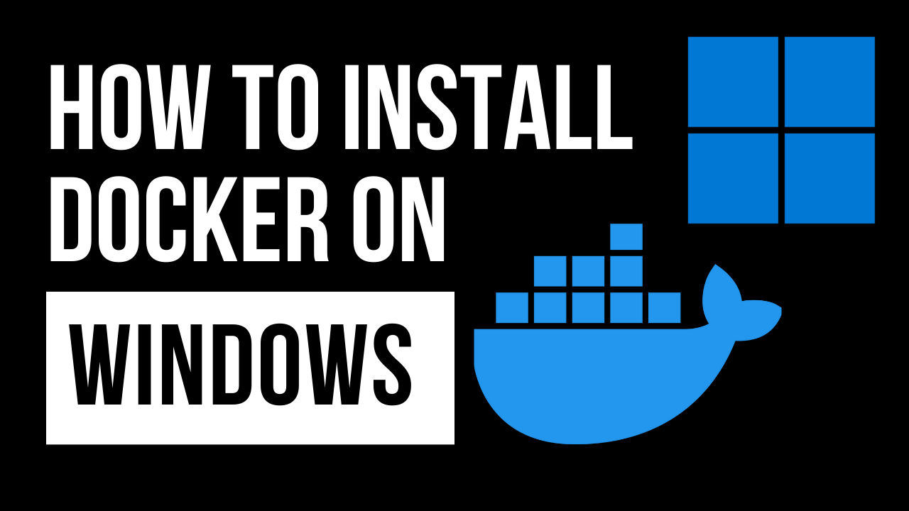

# How to Install Docker on Windows

## Introduction
This guide details the steps to install Docker on a Windows system. Docker is a versatile tool for developers, facilitating the creation, deployment, and management of containerized applications.

[](https://www.youtube.com/watch?v=8MrnvUSW_34)

[Watch the Video](https://www.youtube.com/watch?v=8MrnvUSW_34)

## Requirements 
- A Windows 10 64-bit: Pro, Enterprise, or Education (Build 15063 or later), or Windows 11
- Hyper-V and Containers Windows features must be enabled
- BIOS-level hardware virtualization support must be enabled in the BIOS settings

## Installation Steps

### Step 1: Download Docker Desktop for Windows
Go to the Docker Hub to download Docker Desktop for Windows. Use this link:

[Docker Hub - Docker Desktop for Windows](https://hub.docker.com/editions/community/docker-ce-desktop-windows/)

Opt for the stable version for a more stable experience.

### Step 2: Install Docker Desktop
- Open the downloaded `.exe` file to start the installation.
- Follow the on-screen instructions to complete the installation. You might need to choose whether to use Windows containers instead of Linux containers during this process.
- Docker will ask for permissions to enable Hyper-V; allow this to complete the installation.

### Step 3: Reboot Your System
- Restart your computer to ensure all Docker components are properly set up.

### Step 4: Start Docker Desktop
- After rebooting, start Docker Desktop from the Start menu.
- The Docker icon in the system tray will indicate that Docker is running.

### Step 5: Verify the Installation
To check if Docker has been installed correctly, open a command prompt or PowerShell and enter:

```powershell
docker --version
```

This command should return the Docker version, confirming the installation.

### Step 6: Run a Test Container
Test the setup by running a Docker container:

```powershell
docker run hello-world
```

This command downloads a test image and runs it in a container. If the installation is correct, you'll see a "Hello from Docker!" message.

## Post-installation Steps
- You can adjust Docker's settings by right-clicking the Docker system tray icon and selecting "Settings".
- Customize resources, network settings, shared drives, and more according to your development needs.

## Conclusion
Docker is now installed and ready to use on your Windows system. For more comprehensive information and advanced features, refer to the [Docker documentation](https://docs.docker.com/docker-for-windows/).


## How to Contribute 🤝

Contributions to this project are welcome! Whether you want to fix a bug, improve documentation, or add new features, please check out our [Contribution Guidelines](../CONTRIBUTING.md) to get started.

## License 📜

This project is licensed under the [MIT License](../LICENSE), so you're free to use it in your own projects.

## Support My Work

Creating free, high-quality videos and resources for everyone is challenging. Your support enables me to invest more in content creation, enhancing overall quality. Becoming a member offers significant support and comes with cool perks as a token of appreciation.

Remember, ***support is optional***. Whether you choose to become a member or not, you'll have full access to all my videos and resources.

Support here: [https://www.patreon.com/thiagodsantos](https://www.patreon.com/thiagodsantos) or [https://www.buymeacoffee.com/thiagodsantos](https://www.buymeacoffee.com/thiagodsantos)