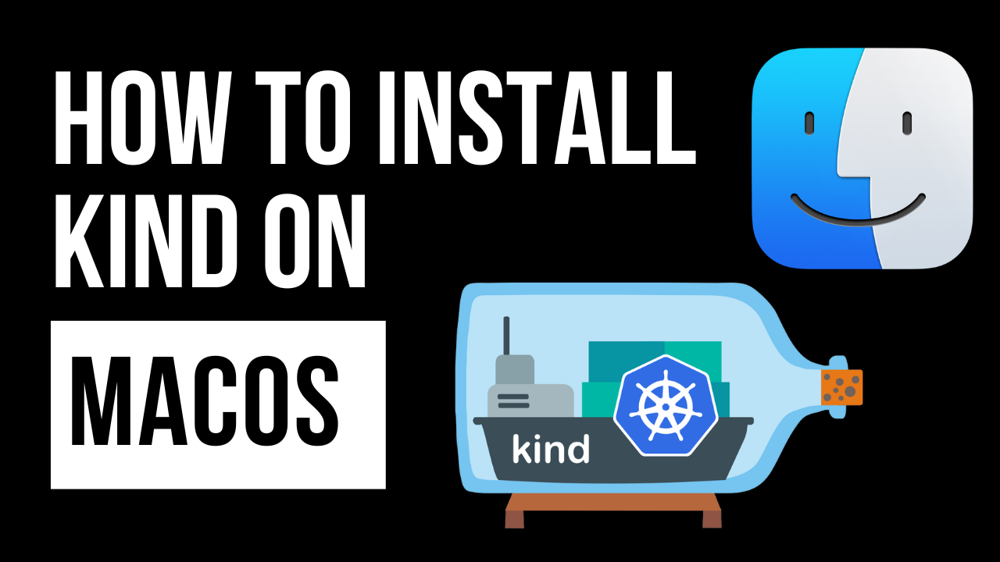

# KinD Installation Guide for macOS

This guide outlines the steps to install KinD (Kubernetes in Docker) on a macOS system. KinD is an effective tool for running local Kubernetes clusters using Docker containers.

[](https://www.youtube.com/watch?v=s1gmbUgVkL4)

[Watch the Video](https://www.youtube.com/watch?v=s1gmbUgVkL4)

## Requirements 

Ensure you have the following prerequisites:
- Docker Desktop for MacOS is installed and running. [How to install Docker on MacOS](https://www.youtube.com/watch?v=knarlToekQ0&t)
- Access to a terminal.

## Step 1: Install Docker Desktop for macOS

If Docker Desktop is not installed:

1. Download Docker Desktop for macOS from the [Docker website](https://www.docker.com/products/docker-desktop).
2. Follow the installation instructions.

Ensure Docker Desktop is running before proceeding.

## Step 2: Install kubectl

kubectl is the Kubernetes command-line tool for interacting with Kubernetes clusters. Install it using Homebrew:

```bash
brew install kubectl 
```

Or download it manually following instructions from the [Kubernetes website](https://kubernetes.io/docs/tasks/tools/install-kubectl-macos/).

Verify the installation:

```bash
kubectl version --client
```

## Step 3: Install KinD

Install KinD using Homebrew:

```bash
brew install kind
```

Or install it manually:

```bash
curl -Lo ./kind "https://kind.sigs.k8s.io/dl/v0.11.1/kind-darwin-amd64"
chmod +x ./kind
mv ./kind /usr/local/bin/kind
```

Replace `v0.11.1` with the latest KinD version.

## Step 4: Create a Kubernetes Cluster

Create a Kubernetes cluster using:

```bash
kind create cluster
```

This command will create a default cluster named "kind".

## Step 5: Verify the Installation

Check if your cluster is set up correctly:

```bash
kubectl cluster-info
```

You should see information about the running cluster.

## Conclusion

You've successfully installed KinD on your macOS system and created a Kubernetes cluster. You can now start deploying your applications in this local Kubernetes environment.

For more detailed information and advanced configurations, visit the [KinD Documentation](https://kind.sigs.k8s.io/docs/user/quick-start/).

## Support My Work

Creating free, high-quality videos and resources for everyone is challenging. Your support enables me to invest more in content creation, enhancing overall quality. Becoming a member offers significant support and comes with cool perks as a token of appreciation.

Remember, ***support is optional***. Whether you choose to become a member or not, you'll have full access to all my videos and resources.

Support here: [https://www.patreon.com/thiagodsantos](https://www.patreon.com/thiagodsantos) or [https://www.buymeacoffee.com/thiagodsantos](https://www.buymeacoffee.com/thiagodsantos)
