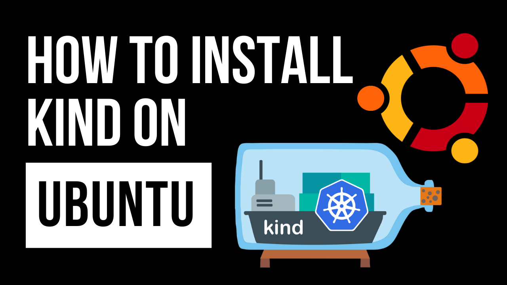

---
# Kind Installation Guide for Ubuntu

This guide provides step-by-step instructions on how to install KinD (Kubernetes in Docker) on a Linux system. KinD is a tool for running local Kubernetes clusters using Docker containers.

[](https://www.youtube.com/watch?v=rFAQRhi-Vs0)

[Watch the Video](https://www.youtube.com/watch?v=rFAQRhi-Vs0)

## Requirements

Before you begin, ensure that the following prerequisites are met:
- Docker is installed and running on your system. [How to install Docker on Ubuntu](https://youtu.be/f1JqnioiCaQ)
- You have sudo or root access to your Linux system.

## Step 1: Install kubectl

kubectl is the Kubernetes command-line tool that allows you to run commands against Kubernetes clusters. Install it by running:

```bash
curl -LO "https://storage.googleapis.com/kubernetes-release/release/`curl -s https://storage.googleapis.com/kubernetes-release/release/stable.txt`/bin/linux/amd64/kubectl"
chmod +x ./kubectl
sudo mv ./kubectl /usr/local/bin/kubectl
kubectl version --client
```

## Step 2: Install KinD

Now, install KinD using the following command:

```bash
curl -Lo ./kind "https://kind.sigs.k8s.io/dl/v0.11.1/kind-$(uname)-amd64"
chmod +x ./kind
sudo mv ./kind /usr/local/bin/kind
```

Replace `v0.11.1` with the latest KinD version.

## Step 3: Create a Kubernetes Cluster

To create a Kubernetes cluster, simply run:

```bash
kind create cluster
```

This command will create a default cluster named "kind".

## Step 4: Verify Installation

Verify that your cluster is correctly set up:

```bash
kubectl cluster-info
```
## Step 5: Create a pod

```bash
kubectl run nginx --image=nginx:latest
```
You should see the cluster information and its status.

## Conclusion

You have now successfully installed KinD on your Linux system and created a Kubernetes cluster. You can begin deploying your applications in this local Kubernetes environment.

For more detailed information and advanced configurations, visit the [KinD Documentation](https://kind.sigs.k8s.io/docs/user/quick-start/).

## How to Contribute 🤝

Contributions to this project are welcome! Whether you want to fix a bug, improve documentation, or add new features, please check out our [Contribution Guidelines](../CONTRIBUTING.md) to get started.

## License 📜

This project is licensed under the [MIT License](../LICENSE), so you're free to use it in your own projects.


## Support My Work

Creating free, high-quality videos and resources for everyone is challenging. Your support enables me to invest more in content creation, enhancing overall quality. Becoming a member offers significant support and comes with cool perks as a token of appreciation.

Remember, ***support is optional***. Whether you choose to become a member or not, you'll have full access to all my videos and resources.

Support here: [https://www.patreon.com/thiagodsantos](https://www.patreon.com/thiagodsantos) or [https://www.buymeacoffee.com/thiagodsantos](https://www.buymeacoffee.com/thiagodsantos)
