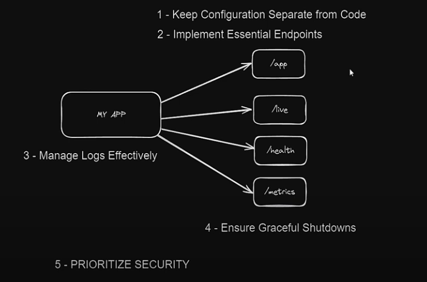

# Project CloudRun and K8s Password Generator 

Welcome to the guide for building and managing the Password Generator app using the provided Makefile. This guide will walk you through the steps to use the Makefile to build, run, and deploy the app.

## Project Overview

The Password Generator app is a tool for generating secure passwords. The Makefile helps automate various tasks related to building, running, testing, and deploying this application.

 


## Steps to Build and Deploy the App

### 1. **Install Necessary Tools**

First, you'll need to install some tools required for building and deploying the app.

```bash
make install
```

This command installs `helm` and `kubectl` using Homebrew.

### 2. **Build the Docker Image**

To build the Docker image for the Password Generator app, use:

```bash
make docker-build
```

This command creates a Docker image tagged `thiagousa/password-generator-app:latest` using the Dockerfile in `my-app-local/password-generator-app`.

### 3. **Run the Docker Container**

Once the image is built, you can run it with:

```bash
make docker-run
```

This starts the Docker container and maps port 3000 on your local machine to port 3000 in the container.

### 4. **Check the Docker Container**

To verify that the container is running, use:

```bash
make docker-check
```

This command lists running Docker containers and filters for the password generator container.

### 5. **View Logs**

To see the logs from the running container, use:

```bash
make docker-logs
```

This command shows real-time logs from the container.

### 6. **Remove the Docker Container**

If you need to stop and remove the container, use:

```bash
make docker-remove
```

This command forcibly removes the container named `password`.

### 7. **Push and Pull Docker Images**

To push the Docker image to a remote repository:

```bash
make docker-push
```

To pull the Docker image from the remote repository:

```bash
make docker-pull
```

### 8. **Perform Load Testing**

To install the load testing tool (Artillery):

```bash
make load-test-install
```

To start a load test, use:

```bash
make load-test-start
```

This will run the load test defined in `my-app-local/password-generator-app/loadtest/loadtest.yaml`.

### 9. **Kubernetes Management**

- **List Kubernetes Contexts:**

  ```bash
  make kubernetes-context
  ```

- **Select a Kubernetes Context:**

  ```bash
  make kubernetes-select
  ```

  Use this to switch to the `rancher-desktop` context or another context of your choice.

- **Check Kubernetes Pods:**

  ```bash
  make kubernetes-check
  ```

- **Forward Ports to Local Machine:**

  ```bash
  make kubernetes-forward
  ```

  This maps port 3000 of the Kubernetes service to your local machine's port 3000.

### 10. **Manage Helm Charts**

- **Create a Helm Chart:**

  ```bash
  make helm-create
  ```

- **Install the Helm Chart:**

  ```bash
  make helm-install
  ```

- **Generate a Deployment YAML File:**

  ```bash
  make helm-deploy
  ```

### 11. **Google Cloud Management**

- **Log into Google Cloud:**

  ```bash
  make gcloud-login
  ```

- **Set the Google Cloud Project:**

  ```bash
  make gcloud-config
  ```

- **Check the Current Project:**

  ```bash
  make gcloud-check-project
  ```

- **Build and Push to Google Container Registry:**

  ```bash
  make cloud-build
  ```

- **Deploy to Google Cloud Run:**

  ```bash
  make cloud-deploy
  ```

- **Delete the Cloud Run Service:**

  ```bash
  make cloud-delete
  ```

## Summary

To build and deploy the Password Generator app, follow these steps:

1. Install tools: `make install`
2. Build the Docker image: `make docker-build`
3. Run the Docker container: `make docker-run`
4. Check the container and view logs as needed
5. Push and pull Docker images as required
6. Perform load testing if necessary
7. Manage Kubernetes and Helm charts as needed
8. Use Google Cloud commands to build, deploy, and manage cloud services

Use the Makefile to streamline these tasks and simplify your development workflow.