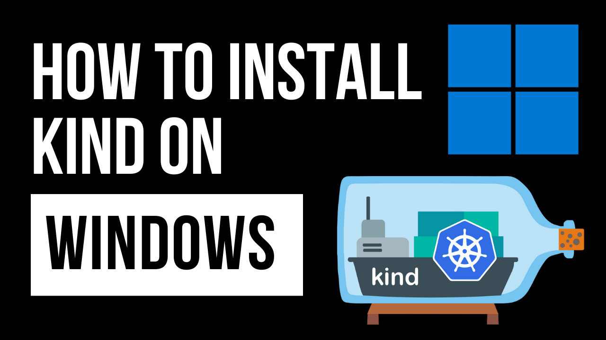

---
# Kind Installation Guide for Windows

This guide provides detailed instructions on how to install KinD (Kubernetes in Docker) on a Windows system. KinD is a powerful tool for running local Kubernetes clusters using Docker containers.



## Prerequisites

Before starting, ensure you meet the following prerequisites:
- Docker Desktop for Windows is installed and running.
- You have administrative access to your Windows machine.

## Step 1: Install Docker Desktop for Windows

If Docker Desktop is not already installed, download and install it from the [Docker website](https://www.docker.com/products/docker-desktop).

After installation, make sure Docker is running. You might need to enable Kubernetes in Docker Desktop settings.

## Step 2: Install kubectl

kubectl is the Kubernetes command-line tool that lets you interact with Kubernetes clusters. Install it by following these steps:

1. Download the latest release from [this link](https://kubernetes.io/docs/tasks/tools/install-kubectl-windows/).
2. Add the binary in to your PATH.
3. Test to ensure the version of kubectl is the same as downloaded:

```bash
kubectl version --client
```

## Step 3: Install KinD

To install KinD on Windows, run the following in your command prompt or PowerShell:

```bash
curl.exe -Lo kind-windows-amd64.exe https://kind.sigs.k8s.io/dl/v0.11.1/kind-windows-amd64
Move-Item .\kind-windows-amd64.exe c:\kind\kind.exe
```

Add `c:\kind` to your PATH. Replace `v0.11.1` with the latest version of KinD.

## Step 4: Create a Kubernetes Cluster

Create a Kubernetes cluster by running:

```bash
kind create cluster
```

This command creates a default cluster named "kind".

## Step 5: Verify the Installation

To verify your installation, check if the cluster is up and running:

```bash
kubectl cluster-info
```

You should see the cluster information and status.

## Conclusion

You have successfully installed KinD on your Windows system and created a Kubernetes cluster. You are now ready to deploy applications in this local Kubernetes environment.

For more information and advanced configurations, check out the [KinD Documentation](https://kind.sigs.k8s.io/docs/user/quick-start/).

## Support My Work

Creating free, high-quality videos and resources for everyone is challenging. Your support enables me to invest more in content creation, enhancing overall quality. Becoming a member offers significant support and comes with cool perks as a token of appreciation.

Remember, ***support is optional***. Whether you choose to become a member or not, you'll have full access to all my videos and resources.

Support here: [https://www.patreon.com/thiagodsantos](https://www.patreon.com/thiagodsantos) or [https://www.buymeacoffee.com/thiagodsantos](https://www.buymeacoffee.com/thiagodsantos)